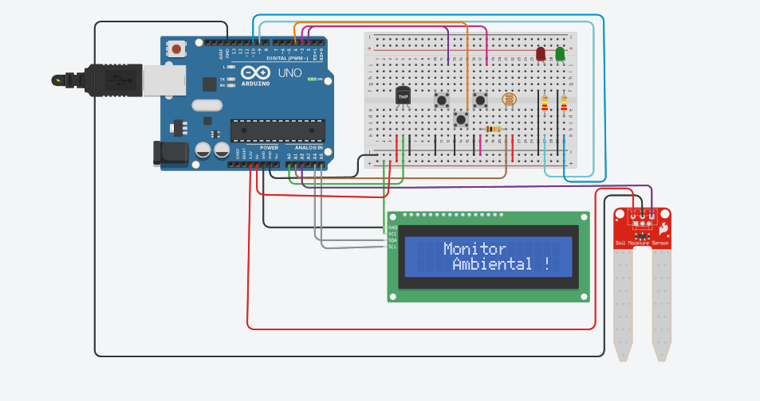

# Monitor Ambiental 

Projeto de monitoramento ambiental desenvolvido com **Arduino**.
Resolvi fazer a junção de três tipos de sensores úteis para o monitoramento de um ambiente: **temperatura, luminosidade e umidade do solo**. A ideia foi reunir as três leituras em um único projeto, utilizando um **display LCD I2C 16x2** para exibir as informações.

---

##  Funcionamento

O projeto possui três botões, cada um responsável por uma leitura:

-  **Temperatura:** verifica a temperatura do ambiente.
-  **Luminosidade:** verifica a quantidade de luz no ambiente.
-  **Umidade:** verifica a umidade do solo.

Para atualizar os dados exibidos, é necessário **pressionar novamente o botão correspondente ao sensor**. Dessa forma, uma nova leitura é realizada e o valor atualizado é mostrado no LCD.

---
## 📸 Projeto

🔗 **Simulação no Tinkercad:**
https://www.tinkercad.com/things/5BXJOROpp48-monitoramento-ambiental?sharecode=6uFnrYMQGwKQWihlsUN8BK08qsSHs3hLeIJOElC2MSE

https://www.tinkercad.com/things/5o7yKvhDl7r-controle-de-acesso?sharecode=rBwYxlcpqcY145qV7aAYRNQvZRvVbcMN_SBWhpptFwI

