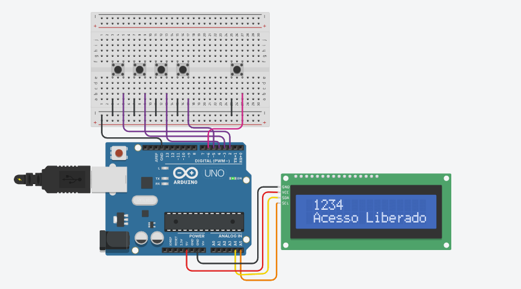

# Controle de Acesso

Projeto de controle de acesso desenvolvido a partir de uma lógica simples em **C++**, criada inicialmente no **VS Code**.
A ideia original era criar um programa que solicitasse uma senha e verificasse se ela estava correta. A partir dessa lógica, o projeto foi adaptado para o **Arduino**.
---

## Funcionamento

O usuário digita a senha utilizando quatro botões, correspondentes aos números **1, 2, 3 e 4**, e utiliza outro botão para confirmar.

-  Botões para digitar a senha
- Botão para confirmar
- LCD para exibir a senha e as mensagens
- Senha correta: `1234`
- Senha incorreta: mensagem exibida no LCD

---

## Tecnologias

- C++
- Arduino
- VS Code
- Tinkercad

---

## 📸 Projeto

---

🔗 **Simulação no Tinkercad:**  

https://www.tinkercad.com/things/5o7yKvhDl7r-controle-de-acesso?sharecode=rBwYxlcpqcY145qV7aAYRNQvZRvVbcMN_SBWhpptFwI

  

