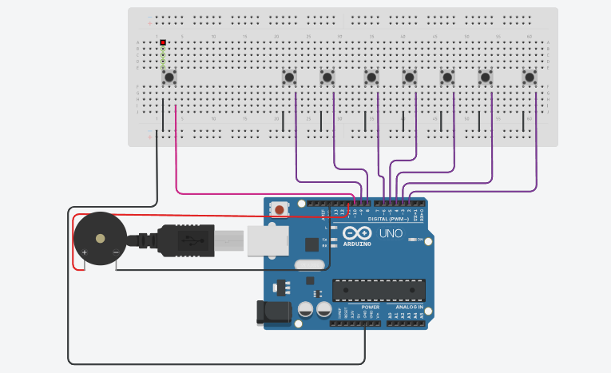

# 🎹 Piano Musical com Arduino

Projeto desenvolvido com **Arduino** que simula um pequeno piano musical. Cada botão corresponde a uma nota musical, permitindo tocar diferentes notas e também reproduzir uma sequência musical pré-programada.
---

## 📸 Projeto

---
🔗 **Simulação no Tinkercad:**  

https://www.tinkercad.com/things/ltqMXHzgcVd-teclado?sharecode=b6qqMqzMLMv4Hzy_A2fUlY7Rm8nvxQRRNDKNIsj6IiM

---

## Funcionalidades
- 🎵 Reprodução das notas Dó, Ré, Mi, Fá, Sol, Lá e Si
- 🎹 Botões individuais para cada nota
- 🔊 Reprodução de sons através de buzzer
- 🎶 Reprodução de uma sequência musical pré-programada
- 🎛️ Botão dedicado para iniciar a música
