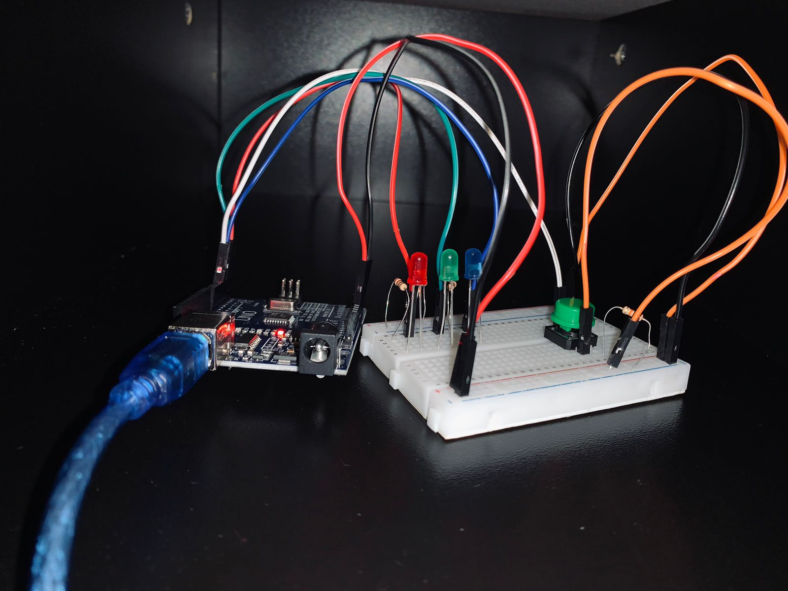

# 🔧 Projeto Arduino — Sequenciador de LEDs

Projeto desenvolvido com Arduino com o objetivo de criar um sistema simples onde os LEDs alternam entre diferentes estados a cada clique de um botão.

## 📌 Objetivo

O circuito funciona como um sequenciador de estados. A cada clique no botão, o sistema muda para o próximo estado:

- Estado 0 → todos os LEDs desligados  
- Estado 1 → LED vermelho ligado  
- Estado 2 → LED vermelho e verde ligados  
- Estado 3 → LED vermelho, verde e azul ligados  

Após o estado 3, o sistema volta ao estado 0 e reinicia o ciclo.

## ⚙️ Componentes utilizados

- 1 Arduino UNO  
- 1 botão push button  
- 3 LEDs (vermelho, verde e azul)  
- 3 resistores de 220Ω (para os LEDs)  
- 1 resistor de 10kΩ (pull-down do botão)  
- Protoboard e jumpers  

## 🔌 Pinos utilizados

- LED vermelho → pino 2  
- LED verde → pino 3  
- LED azul → pino 4  
- Botão → pino 5  

## 🎥 Demonstração

A demonstração do projeto está disponível no arquivo `sequenciador.gif` dentro dos arquivos do repositório.

### 🧪 Simulação online
Você pode ver e interagir com a simulação do projeto aqui:

👉 https://www.tinkercad.com/things/2AwNqvIKLJh-sequenciador-de-leds?sharecode=h19M3iLWU6qmk8sjDJNaExOuh67p9MxL_hQyGR1Daz8

## 🖼️ Imagem do circuito

