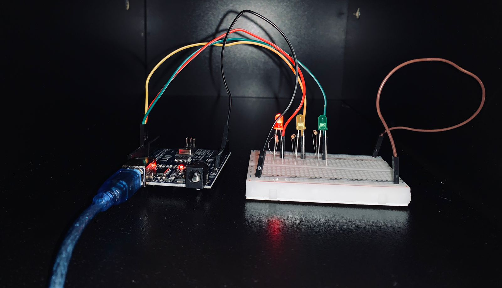

# 🚦 Projeto Arduino — Semáforo Automático Básico

Projeto desenvolvido com Arduino simulando o funcionamento de um semáforo de trânsito, com alternância automática dos leds. 

## 📌 Objetivo

O sistema controla três LEDs que simulam um semáforo real, alternando automaticamente entre os estados de forma contínua, com tempos de delay diferentes para cada sinal:

- 🔴 Vermelho → sinal de fechado.
- 🟡 Amarelo →  sinal de atenção.
- 🟢 Verde → sinal de passagem (aberto).
  O ciclo é repetido infinitamente.

 ## ⏱️ Lógica de funcionamento

- 🔴 Vermelho → 6 segundos  
- 🟢 Verde → 8 segundos  
- 🟡 Amarelo → 4 segundos  

## ⚙️ Componentes utilizados

- 1 Arduino UNO  
- 1 LED vermelho  
- 1 LED amarelo  
- 1 LED verde  
- 3 resistores de 220Ω  
- Protoboard e jumpers

  ## 🔌 Pinos utilizados

- LED vermelho → pino 8  
- LED amarelo → pino 9  
- LED verde → pino 10

## 🎥 Demonstração 

### 📷 Foto do projeto

### 🧪 Simulação online
Você pode ver e interagir com a simulação do projeto aqui:

👉 https://www.tinkercad.com/things/jQfuL2q9p2P-semaforo-basico?sharecode=O8mLiMwd3w3At8D1mVAhrwimOae2iaSHi3HSL6K-R3k

