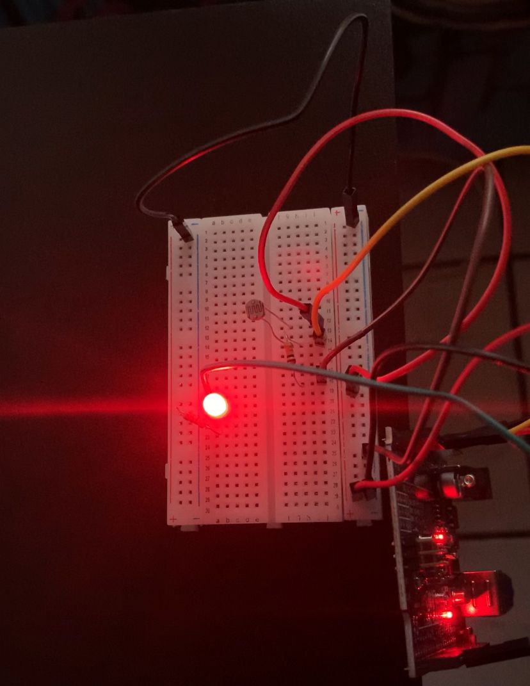

# 💡 Projeto Arduino — LDR com LED

Projeto usando Arduino com sensor LDR para detectar luz ambiente e controlar um LED automaticamente.

## ⚙️ Componentes
- Arduino UNO  
- LDR (fotoresistor)  
- LED  
- Resistor para o LED  
- Resistor para o LDR  
- Protoboard e jumpers

## 🔌 Ligações
- LDR → A0  
- LED → pino 2

## 🎥 Demonstração

👉 Simulação do projeto: https://www.tinkercad.com/things/6K7ZfZRVHgo-sensor-de-luz?sharecode=Ih7AstjLIfKWbMTkk5ZpcLfeRLHypJ76xYST-RynU94
- Para testar mexa no fotoresistor.

  A demonstração do projeto está disponível no arquivo `sensor.gif` dentro dos arquivos do repositório.

### 📷 Montagem do circuito

